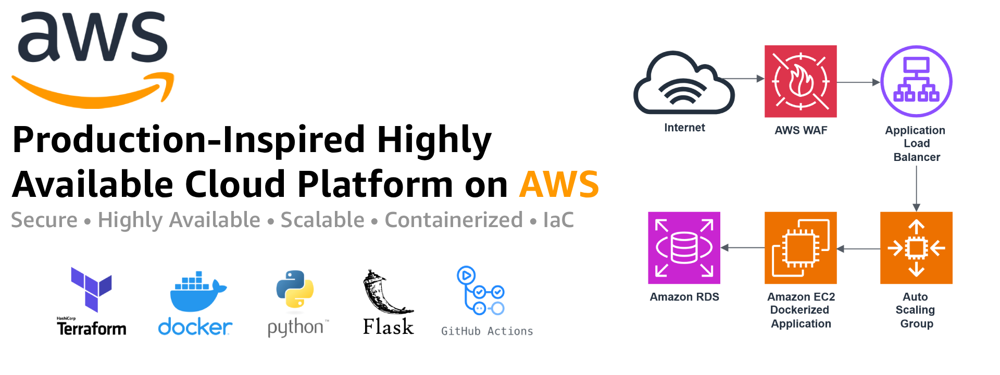
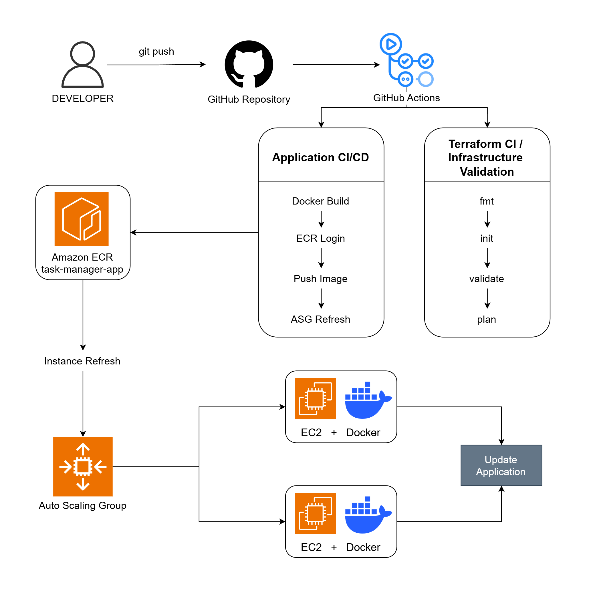
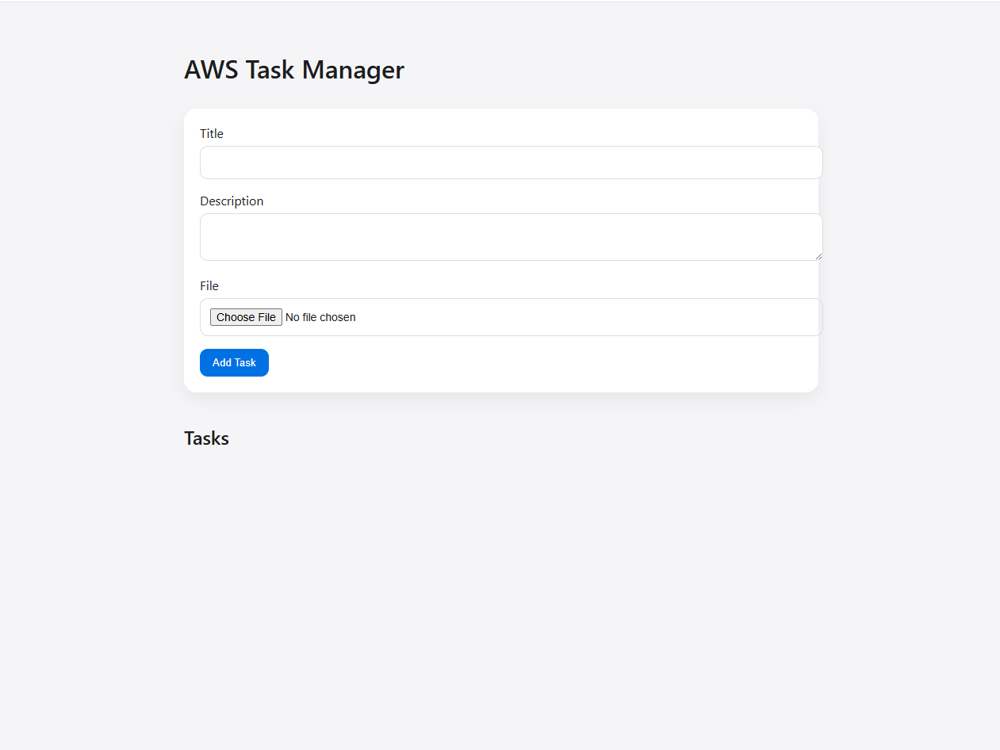
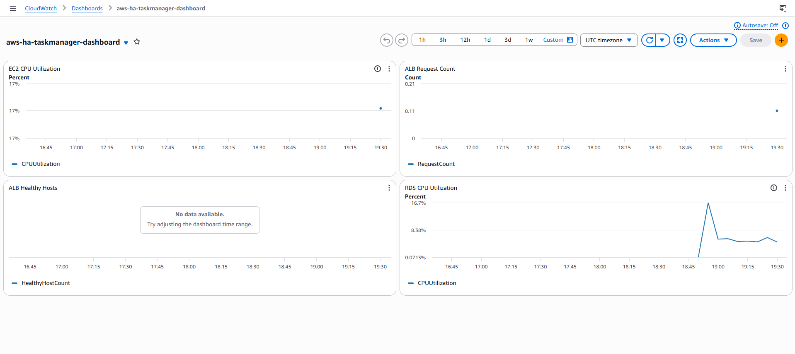
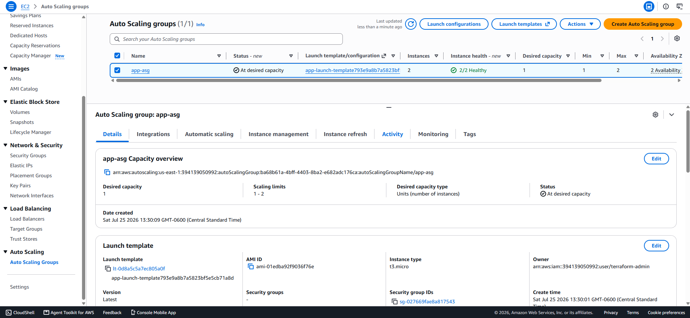
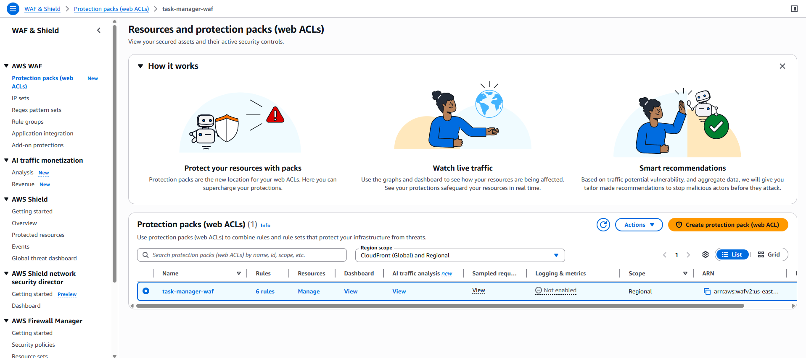
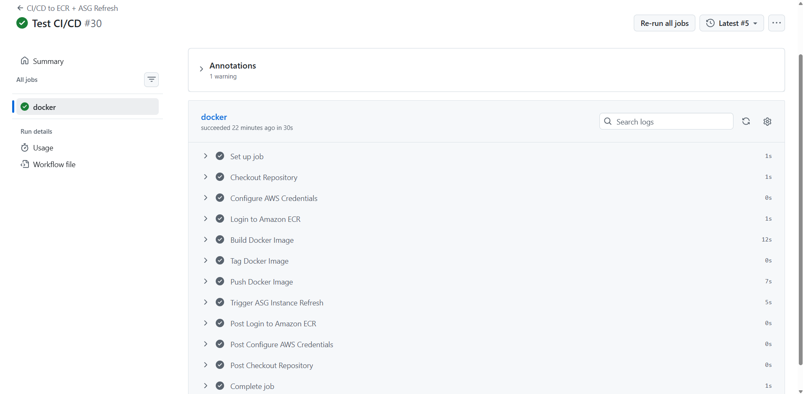

<p align="center">
  
</p>

<p align="center">


</p>

# Production-Inspired Highly Available Cloud Platform on AWS

A production-inspired cloud platform designed and deployed on Amazon Web Services (AWS) to demonstrate modern Cloud Engineering practices. The platform combines Infrastructure as Code (Terraform), containerization (Docker), automated CI/CD deployments (GitHub Actions), secure networking, centralized monitoring, and highly available infrastructure to simulate a real-world production environment.

Following AWS Well-Architected Framework principles, the platform showcases how cloud workloads can be securely deployed and managed using Amazon EC2, Auto Scaling Groups, Application Load Balancers, Amazon RDS PostgreSQL Multi-AZ, Amazon S3, AWS WAF, AWS Secrets Manager, AWS Systems Manager Session Manager, Amazon CloudWatch, Amazon SNS, and Amazon ECR.

---

## Project Overview

This project demonstrates the design and implementation of a **production-inspired, highly available, scalable, and secure cloud platform** on **Amazon Web Services (AWS)**.

The entire infrastructure is provisioned using **Terraform (Infrastructure as Code)** and follows the **AWS Well-Architected Framework**, emphasizing security, reliability, operational excellence, performance efficiency, and automation.

A Dockerized Flask web application serves as the sample workload and is automatically deployed through **GitHub Actions** and **Amazon ECR** onto **Amazon EC2 Auto Scaling Groups** behind an **Application Load Balancer**. The platform integrates **Amazon RDS PostgreSQL Multi-AZ**, **Amazon S3**, **AWS WAF**, **AWS Secrets Manager**, **AWS Systems Manager Session Manager**, **Amazon CloudWatch**, and **Amazon SNS** to provide secure, highly available, and observable cloud infrastructure.

Rather than focusing solely on the application itself, this project emphasizes the design, automation, security, scalability, monitoring, and operational practices required to build and manage modern cloud platforms.

This repository was developed as part of my Cloud Engineering portfolio to demonstrate practical experience designing, deploying, automating, and securing AWS infrastructure using services and best practices commonly adopted in production environments.

### Key Highlights

## Key Features

### Infrastructure
- Infrastructure as Code (Terraform)
- Highly Available Multi-AZ Architecture
- Private Networking with VPC Endpoints
- Auto Scaling with EC2 Launch Templates
- Application Load Balancer (ALB)

### Application
- Dockerized Flask Web Application
- Amazon ECR Container Registry
- Amazon RDS PostgreSQL (Multi-AZ)
- Amazon S3 File Storage

### Security
- AWS Web Application Firewall (WAF)
- AWS Secrets Manager
- AWS IAM Roles (Least Privilege)
- AWS Systems Manager (Session Manager)
- Security Best Practices

### Monitoring
- Amazon CloudWatch Logs
- Amazon CloudWatch Dashboards
- Amazon CloudWatch Alarms
- Amazon SNS Notifications

### DevOps
- GitHub Actions CI/CD Pipeline

## Core Features

- Create and manage tasks through a web interface.
- Add task titles and descriptions.
- Upload files associated with individual tasks.
- Store uploaded files in Amazon S3.
- Persist task metadata in Amazon RDS PostgreSQL.
- Download uploaded files through the application.
- Delete existing tasks and associated data.
- Application health check endpoint for availability monitoring.

## Solution Architecture

The following diagram illustrates the complete AWS architecture implemented in this project.

<p align="center">

</p>

This solution follows the AWS Well-Architected Framework principles and implements a secure, highly available, production-inspired cloud-native architecture.

Incoming traffic is inspected by **AWS WAF** before reaching an **Application Load Balancer (ALB)**, which distributes requests across **Dockerized Flask** application instances running on **Amazon EC2** within an **Auto Scaling Group** spanning multiple Availability Zones.

Application data is stored in **Amazon RDS PostgreSQL (Multi-AZ)**, uploaded files are stored in **Amazon S3**, and sensitive configuration values are securely managed with **AWS Secrets Manager**.

Operational visibility is provided through **Amazon CloudWatch Logs, Dashboards, and Alarms**, while notifications are delivered through **Amazon SNS**. Administrative access is performed securely using **AWS Systems Manager Session Manager**, eliminating the need to expose SSH to the Internet.

The high-level request flow is:

**Internet → AWS WAF → Application Load Balancer → Auto Scaling Group (EC2 + Docker) → Amazon RDS PostgreSQL**

Supporting services include **Amazon ECR** for container images, **Amazon S3** for object storage, **AWS Secrets Manager**, **AWS IAM**, **AWS Systems Manager**, **Amazon CloudWatch**, **Amazon SNS**, and **VPC Endpoints** for private connectivity.


### Architecture Highlights

* Multi-AZ Highly Available Architecture
* Private Application Servers
* Dockerized Flask Application
* Infrastructure as Code (Terraform)
* Auto Scaling Group
* Application Load Balancer
* AWS Web Application Firewall (WAF)
* Amazon RDS PostgreSQL (Multi-AZ)
* Amazon S3 Object Storage
* AWS Secrets Manager
* AWS Systems Manager Session Manager
* Amazon CloudWatch Monitoring
* Amazon SNS Notifications
* CI/CD using GitHub Actions

## Architecture Components

| Layer | AWS Services |
|--------|--------------|
| Edge Layer | AWS WAF |
| Load Balancing | Application Load Balancer |
| Compute Layer | Amazon EC2, Auto Scaling Group |
| Container Platform | Docker |
| Database Layer | Amazon RDS PostgreSQL (Multi-AZ) |
| Storage Layer | Amazon S3 |
| Secrets Management | AWS Secrets Manager |
| Administration | AWS Systems Manager Session Manager |
| Monitoring | Amazon CloudWatch |
| Notifications | Amazon SNS |
| CI/CD | GitHub Actions |
| Infrastructure | Terraform |

## AWS Services Used

The platform integrates multiple AWS managed services to build a secure, scalable, highly available, and production-inspired cloud-native architecture.

Each service was selected to demonstrate real-world cloud engineering practices and follows AWS Well-Architected Framework principles.

| AWS Service                                  | Purpose                                                                                                                                              |
| -------------------------------------------- | ---------------------------------------------------------------------------------------------------------------------------------------------------- |
| **Amazon VPC**                               | Provides network isolation and serves as the foundation of the cloud infrastructure.                                                                 |
| **Public & Private Subnets**                 | Separate Internet-facing resources from backend workloads to improve security.                                                                       |
| **Internet Gateway**                         | Enables Internet connectivity for public resources.                                                                                                  |
| **NAT Gateway**                              | Allows private EC2 instances to securely access the Internet without exposing public IP addresses.                                                   |
| **Application Load Balancer (ALB)**          | Distributes incoming traffic across multiple EC2 instances and performs health checks.                                                               |
| **AWS WAF**                                  | Protects the application against common web attacks such as SQL Injection (SQLi), Cross-Site Scripting (XSS), malicious IPs, and excessive requests. |
| **Amazon EC2**                               | Hosts the Dockerized Flask application.                                                                                                              |
| **Auto Scaling Group (ASG)**                 | Automatically scales EC2 instances based on workload demand while maintaining high availability.                                                     |
| **Docker**                                   | Packages the application and its dependencies into portable containers for consistent deployments.                                                   |
| **Amazon Elastic Container Registry (ECR)**  | Stores private Docker images used during deployments.                                                                                                |
| **Amazon RDS PostgreSQL (Multi-AZ)**         | Provides a managed relational database with automatic failover and high availability.                                                                |
| **Amazon S3**                                | Stores application files and uploaded content with virtually unlimited scalability.                                                                  |
| **AWS Secrets Manager**                      | Securely stores and manages sensitive application credentials.                                                                                       |
| **AWS Identity and Access Management (IAM)** | Implements least-privilege access using IAM Roles and Policies.                                                                                      |
| **AWS Systems Manager Session Manager**      | Provides secure administrative access to EC2 instances without requiring SSH keys or public SSH access.                                              |
| **Amazon CloudWatch**                        | Collects metrics, logs, dashboards, and alarms for infrastructure monitoring and observability.                                                      |
| **Amazon SNS**                               | Sends notifications when CloudWatch alarms are triggered.                                                                                            |
| **GitHub Actions**                           | Implements Continuous Integration and Continuous Deployment (CI/CD) pipelines.                                                                       |
| **Terraform**                                | Provisions and manages the entire AWS infrastructure using Infrastructure as Code (IaC).                                                             |
| **VPC Endpoints**                            | Provide private access to AWS services (such as Amazon S3 and AWS Systems Manager) from resources within the VPC.                                    |


# Architecture Capabilities

The architecture is designed around key cloud engineering principles, including high availability, scalability, infrastructure as code, containerization, security, automation, observability, operational excellence, and cost optimization.

The following sections describe the key architectural capabilities and engineering practices implemented throughout the platform.

## High Availability

The platform is designed to minimize downtime and improve application availability through a Multi-AZ architecture.

Key components include:

- Application Load Balancer deployed across multiple Availability Zones.
- EC2 instances distributed across multiple Availability Zones.
- Auto Scaling Group for instance replacement and self-healing.
- Amazon RDS PostgreSQL with Multi-AZ deployment.
- Health checks configured between the Application Load Balancer and application instances.
- Application Load Balancer distributes traffic across healthy EC2 instances.

If an EC2 instance becomes unhealthy or fails, the Auto Scaling Group can automatically replace it, while the Application Load Balancer routes traffic to healthy instances.

## Scalability

The architecture supports horizontal scaling to handle changes in application demand.

Scalability mechanisms include:

- Application Load Balancer for distributing incoming traffic.
- Auto Scaling Group for dynamically adjusting EC2 capacity.
- Docker containers for consistent application deployments.
- Amazon S3 for scalable object storage.
- Amazon RDS PostgreSQL for managed relational database workloads.

The Auto Scaling Group can increase or decrease the number of EC2 instances based on configured scaling policies and workload requirements.

## Infrastructure as Code (IaC)

The entire AWS infrastructure is provisioned and managed using Terraform.

Terraform is used to define and manage:

- Amazon VPC
- Public and Private Subnets
- Internet Gateway
- NAT Gateway
- VPC Gateway Endpoints
- VPC Interface Endpoints
- Security Groups
- IAM Roles and Instance Profiles
- Application Load Balancer
- Auto Scaling Group
- EC2 Launch Templates
- Amazon RDS
- Amazon S3
- Amazon ECR
- AWS Secrets Manager
- Amazon CloudWatch
- Amazon SNS
- AWS WAF

Benefits of using Infrastructure as Code include:

- Repeatable deployments
- Version-controlled infrastructure
- Automated provisioning
- Consistent environments
- Reduced configuration drift
- Easier infrastructure changes

## Containerization

The web application is containerized using Docker to provide a consistent and portable application runtime.

The application is built using:

- Python
- Flask
- Docker

The Docker image is stored in Amazon ECR and deployed to EC2 instances running within the Auto Scaling Group.

The deployment flow is:

GitHub Repository
→ Docker Build
→ Amazon ECR
→ Auto Scaling Group
→ EC2
→ Docker Container
→ Application Load Balancer

## Network Architecture

The platform is deployed inside a dedicated Amazon Virtual Private Cloud (VPC) designed to provide secure network isolation, workload segmentation, and private connectivity between AWS resources.

The network architecture spans two Availability Zones and separates public-facing services from application and database workloads using dedicated subnets.

### Network Components

- Amazon VPC
- Two Availability Zones
- Two Public Subnets
- Two Private Application Subnets
- Two Private Database Subnets
- Internet Gateway
- NAT Gateway
- Public and Private Route Tables
- Security Groups
- Amazon S3 Gateway Endpoint
- Interface VPC Endpoints

<p align="center">
  
</p>

### Design Principles

The network was designed following AWS networking best practices:

- Public-facing resources are isolated from backend services.
- Application instances are deployed in private subnets.
- Database instances remain inaccessible from the public Internet.
- AWS services are accessed privately through VPC Endpoints whenever possible.
- Security Groups enforce least-privilege network access.
- Internet traffic enters the infrastructure exclusively through the Application Load Balancer.

This design improves security, reduces Internet exposure, and provides a scalable foundation for production-inspired workloads.

## Security & Compliance

The project follows AWS security best practices to protect infrastructure, application resources, and sensitive data.

### Network Security

- Dedicated Amazon VPC
- Public and Private Subnets
- Network Segmentation
- Internet Gateway
- NAT Gateway
- VPC Endpoints

### Compute Security

- EC2 Instances deployed in Private Subnets
- Security Groups with least privilege access
- Session Manager for administrative access (no public SSH)

### Identity & Access Management

- IAM Roles
- IAM Instance Profiles
- Least Privilege Principle
- No hardcoded AWS credentials

### Secrets Management

- Database credentials stored in AWS Secrets Manager
- Secrets retrieved dynamically by the application

### Private AWS Service Connectivity

VPC Endpoints are used to provide private connectivity between application resources in private subnets and supported AWS services.

The architecture uses:

- Amazon S3 Gateway VPC Endpoint.
- AWS Secrets Manager Interface VPC Endpoint.
- Amazon ECR API Interface VPC Endpoint.
- Amazon ECR DKR Interface VPC Endpoint.
- Amazon CloudWatch Logs Interface VPC Endpoint.

This design reduces the need to route traffic to these AWS services through the public internet and supports private communication from application resources deployed in private subnets.

### Database Security

- Amazon RDS PostgreSQL deployed in Private Subnets
- No public database endpoint
- Security Group restrictions

### Application Security

- Docker container isolation
- AWS WAF protection
- Application Load Balancer
- Secure HTTPS-ready architecture

### Monitoring & Auditing

- CloudWatch Logs
- CloudWatch Metrics
- CloudWatch Alarms
- Amazon SNS Notifications

## Monitoring & Observability

The platform provides centralized monitoring and operational visibility using Amazon CloudWatch.

### CloudWatch Features

- Infrastructure Metrics
- Application Logs
- CPU Utilization Monitoring
- Memory Monitoring
- Auto Scaling Metrics
- Application Health Monitoring

### CloudWatch Alarms

Configured alarms include:

- High CPU Utilization
- Instance Status Checks
- Auto Scaling Events
- Application Availability

### Notifications

Amazon SNS is configured to send email notifications when CloudWatch alarms are triggered.

## CI/CD & Automation

The project implements an automated Continuous Integration and Continuous Deployment (CI/CD) pipeline using GitHub Actions.

### Pipeline Workflow

1. Source Code Push
2. GitHub Actions Trigger
3. Docker Image Build
4. Push Image to Amazon ECR
5. Auto Scaling Group Instance Refresh
6. New EC2 Instances Pull Latest Docker Image
7. Application Deployment

Terraform infrastructure validation is also executed automatically through GitHub Actions.

### Benefits

- Automated Deployments
- Consistent Infrastructure
- Reduced Manual Operations
- Faster Delivery
- Version Controlled Infrastructure


# Architecture Design Decisions

This project was designed to simulate a production-inspired AWS environment by following the principles of the AWS Well-Architected Framework. Every service and architectural component was intentionally selected to improve security, scalability, reliability, automation, and operational efficiency.

Rather than deploying a simple web application on a single EC2 instance, the infrastructure was designed to resemble a real-world cloud environment using Infrastructure as Code, managed AWS services, and security best practices.

---

## Infrastructure as Code (Terraform)

### Decision
Provision and manage the entire AWS infrastructure using Terraform.

### Why?

- Infrastructure is fully version-controlled.
- Deployments are repeatable and consistent.
- Eliminates manual resource provisioning.
- Simplifies infrastructure maintenance and updates.

---

## Amazon Virtual Private Cloud (VPC)

### Decision
Deploy all infrastructure inside a dedicated Amazon VPC.

### Why?

- Provides network isolation.
- Enables secure network segmentation.
- Supports private application and database tiers.
- Allows complete control over routing and security.

---

## Multi-Availability Zone Architecture

### Decision
Distribute the infrastructure across two Availability Zones.

### Why?

- Eliminates single points of failure.
- Improves application availability.
- Increases infrastructure resilience.
- Supports production-inspired high availability.

---

## Public and Private Subnets

### Decision
Separate the infrastructure into six subnets:

- Public Subnet A
- Public Subnet B
- Private Application Subnet A
- Private Application Subnet B
- Private Database Subnet A
- Private Database Subnet B

### Why?

- Internet-facing resources remain isolated from backend services.
- EC2 instances are protected from direct Internet access.
- Database resources remain private.
- Improves overall network security.

---

## Application Load Balancer (ALB)

### Decision
Use an Application Load Balancer as the public entry point.

### Why?

- Distributes traffic across multiple EC2 instances.
- Performs automatic health checks.
- Provides a single endpoint for users.
- Integrates with AWS WAF.

---

## Auto Scaling Group

### Decision
Deploy EC2 instances inside an Auto Scaling Group.

### Why?

- Automatically replaces unhealthy instances.
- Supports future horizontal scaling.
- Improves application availability.
- Reduces operational overhead.

---

## Docker Containers

### Decision
Containerize the Flask application using Docker.

### Why?

- Ensures consistent runtime environments.
- Simplifies deployments.
- Improves application portability.
- Eliminates dependency inconsistencies.

---

## Amazon Elastic Container Registry (ECR)

### Decision
Store Docker images in Amazon ECR.

### Why?

- Secure private container registry.
- Native AWS integration.
- Simplifies automated deployments.
- Centralized image management.

---

## Amazon RDS PostgreSQL (Multi-AZ)

### Decision
Use Amazon RDS PostgreSQL configured with Multi-AZ deployment.

### Why?

- Managed relational database service.
- Automatic backups.
- Automatic failover.
- High availability.
- Reduced database administration.

---

## Amazon S3

### Decision
Store uploaded files in Amazon S3.

### Why?

- Highly durable object storage.
- Separates application servers from persistent storage.
- Prevents data loss during EC2 replacement.
- Supports future application scaling.

---

## AWS Secrets Manager

### Decision
Store database credentials in AWS Secrets Manager.

### Why?

- Prevents hardcoded credentials.
- Securely manages sensitive information.
- Supports secret rotation.
- Follows AWS security best practices.

---

## IAM Roles

### Decision
Grant AWS permissions through IAM Roles instead of access keys.

### Why?

- Eliminates long-term credentials.
- Reduces security risks.
- Supports least-privilege access.
- Recommended AWS authentication method.

---

## AWS Systems Manager Session Manager

### Decision
Manage EC2 instances using Session Manager instead of SSH.

### Why?

- No SSH keys required.
- No bastion host required.
- No public SSH port exposed.
- Fully auditable administrative sessions.

---

## VPC Interface Endpoints

### Decision
Deploy Interface Endpoints for AWS services.

Services:

- Amazon ECR API
- Amazon ECR DKR
- AWS Secrets Manager
- Amazon CloudWatch Logs

### Why?

- Traffic remains inside the AWS network.
- Eliminates unnecessary Internet traffic.
- Improves security.
- Provides private access to AWS services.

---

## Amazon S3 Gateway Endpoint

### Decision
Access Amazon S3 through a Gateway Endpoint.

### Why?

- Private communication with Amazon S3.
- No Internet Gateway required.
- Improved security.
- Lower networking costs.

---

## AWS WAF

### Decision
Protect the Application Load Balancer using AWS WAF.

### Why?

- Filters malicious HTTP requests.
- Protects against common web attacks.
- Adds an additional security layer.
- Native integration with ALB.

---

## Amazon CloudWatch

### Decision
Monitor the infrastructure using Amazon CloudWatch.

### Why?

- Centralized monitoring.
- Metrics collection.
- Log aggregation.
- Infrastructure visibility.
- Alarm generation.

---

## Amazon SNS

### Decision
Use Amazon SNS to deliver CloudWatch alarm notifications.

### Why?

- Immediate operational alerts.
- Faster incident response.
- Reliable notification delivery.
- Simple monitoring workflow.

---

## GitHub Actions

### Decision
Automate infrastructure deployment using GitHub Actions.

### Why?

- Automated CI/CD pipeline.
- Infrastructure validation before deployment.
- Repeatable deployments.
- Reduces manual errors.
- Improves deployment consistency.

---

# AWS Well-Architected Framework Alignment

The architecture was intentionally designed following the five pillars of the AWS Well-Architected Framework.

| Pillar | Implementation |
|---------|----------------|
| **Operational Excellence** | Infrastructure as Code with Terraform, automated deployments using GitHub Actions, centralized monitoring with CloudWatch. |
| **Security** | IAM Roles, AWS WAF, Security Groups, Secrets Manager, Session Manager, and VPC Endpoints. |
| **Reliability** | Multi-AZ architecture, Auto Scaling Group, Application Load Balancer, Amazon RDS Multi-AZ, and health checks. |
| **Performance Efficiency** | Dockerized application, Application Load Balancer, Auto Scaling, and managed AWS services. |
| **Cost Optimization** | Auto Scaling, managed database service, Amazon S3 object storage, and Infrastructure as Code to reduce operational overhead. |

## Cost Considerations

This project is designed as a production-oriented AWS architecture and may incur costs depending on the AWS Region, resource configuration, workload, traffic volume, and usage patterns.

The following table provides a high-level overview of the primary AWS resources that may contribute to the overall cost.

### AWS Cost Factors

| AWS Service               | Resource / Configuration                              | Cost Consideration                                                                              |
| ------------------------- | ----------------------------------------------------- | ----------------------------------------------------------------------------------------------- |
| Amazon EC2                | `t3.micro` instances managed by an Auto Scaling Group | Charged based on instance runtime and number of running instances                               |
| Application Load Balancer | Regional Application Load Balancer                    | Hourly usage and Load Balancer Capacity Units (LCUs)                                            |
| Auto Scaling              | EC2 capacity                                          | No additional Auto Scaling charge; costs vary with the number and type of running EC2 instances |
| Amazon RDS                | PostgreSQL `db.t3.micro`, Multi-AZ                    | Instance runtime, storage, backups, and Multi-AZ configuration                                  |
| Amazon S3                 | Application file storage                              | Storage capacity, request volume, and data transfer                                             |
| Amazon ECR                | Private container image storage                       | Image storage and data transfer considerations                                                  |
| Amazon CloudWatch         | Logs, metrics, dashboards, and alarms                 | Charges may apply based on log ingestion, storage, metrics, and monitoring usage                |
| Amazon SNS                | Email notifications                                   | Generally low cost for low-volume email-based notifications                                     |
| AWS Secrets Manager       | Database credentials                                  | Charged per stored secret and API usage                                                         |
| AWS WAF                   | Web ACL and AWS Managed Rules                         | Charges based on Web ACLs, rules, and request volume                                            |
| NAT Gateway               | Private subnet internet access                        | Hourly charges and data processing costs                                                        |
| VPC Interface Endpoints   | 4 Interface Endpoints across 2 Availability Zones     | Charged per endpoint interface-hour and data processed                                          |
| S3 Gateway Endpoint       | Private S3 connectivity                               | No hourly endpoint charge; helps avoid NAT Gateway processing for S3 traffic                    |

### Estimated Monthly Cost

This estimate represents the expected monthly infrastructure cost for the architecture under a low-traffic workload running continuously in the `us-east-1` AWS Region for approximately 730 hours per month.

Actual costs may vary depending on resource utilization, data transfer, storage consumption, logging volume, request volume, and changes in AWS pricing.


| AWS Service                 | Configuration / Assumption                                               |        Estimated Monthly Cost |
| --------------------------- | ------------------------------------------------------------------------ | ----------------------------: |
| Amazon EC2                  | 1 × `t3.micro` running continuously                                      |                        ~$7.60 |
| Amazon EBS                  | 20 GB `gp3` root volume                                                  |                        ~$1.60 |
| Application Load Balancer   | 1 ALB with low traffic and low LCU consumption                           |                      ~$16–$20 |
| Amazon RDS PostgreSQL       | `db.t3.micro`, Multi-AZ, 20 GB storage                                   |                     ~$30–$45+ |
| NAT Gateway                 | 1 NAT Gateway, excluding significant data processing                     |                      ~$32.85+ |
| Amazon S3                   | Low-volume application file storage                                      |                           <$1 |
| Amazon ECR                  | Low-volume container image storage                                       |                           <$1 |
| AWS Secrets Manager         | 1 stored secret with low API usage                                       |                        ~$0.40 |
| Amazon CloudWatch           | Low-volume logs, metrics, alarms, and dashboard                          |                       ~$1–$5+ |
| Amazon SNS                  | Low-volume email notifications                                           |                           <$1 |
| AWS WAF                     | 1 Web ACL with AWS Managed Rules and low request volume                  |                      ~$6–$10+ |
| VPC Interface Endpoints     | 4 endpoints deployed across 2 Availability Zones (8 endpoint interfaces) | ~$58+/month + data processing |
| S3 Gateway Endpoint         | 1 Gateway Endpoint                                                       |     No hourly endpoint charge |
| **Estimated Monthly Total** | **Low-traffic 24/7 portfolio environment**                               |       **~$155–$185+ / month** |

> **Important:** This estimate represents a low-traffic portfolio environment and should not be considered a fixed AWS bill. Actual costs may vary depending on AWS pricing changes, data transfer, NAT Gateway data processing, CloudWatch log ingestion, WAF request volume, VPC Endpoint data processing, RDS configuration, and Auto Scaling activity.


## Cost Optimization

The architecture incorporates several strategies to optimize AWS infrastructure costs:

- EC2 instances use the `t3.micro` instance type for the development environment.
- Auto Scaling dynamically adjusts compute capacity based on workload demand.
- Amazon S3 is used for scalable object storage.
- Amazon RDS provides managed database capabilities, reducing operational overhead.
- CloudWatch monitoring helps identify unnecessary resource utilization.
- Infrastructure is provisioned and managed using Terraform, enabling controlled and repeatable deployments.
- Resources can be destroyed using Terraform when the environment is no longer required.

> **Note:** This project is designed as a portfolio and learning environment. AWS resources may incur costs depending on usage and configuration.

### Important Cost Considerations

Some components of this architecture can contribute significantly to AWS costs, particularly:

- Amazon RDS Multi-AZ deployments.
- NAT Gateways.
- VPC Interface Endpoints.
- Application Load Balancers.
- Amazon EC2.
- AWS WAF.
- Amazon CloudWatch, depending on log ingestion and retention.
- Data transfer.

For a portfolio or learning environment, the infrastructure should be monitored regularly and unused resources should be removed when they are no longer required.

> **Note:** The VPC Interface Endpoints represent a significant fixed networking cost because four Interface Endpoints are deployed across two Availability Zones for improved connectivity resilience. AWS pricing varies by Region, configuration, usage, and pricing model. The values shown in this document are intended as architectural cost considerations rather than a fixed monthly estimate. Always verify current pricing using the official AWS Pricing Calculator before deploying the infrastructure in a production environment.

## Repository Structure

The repository is organized to separate application code, infrastructure, documentation, and CI/CD workflows, making the project easy to understand, maintain, and extend.

```text
aws-ha-task-manager/
│
├── app/                            # Flask application source code
│   ├── app.py
│   ├── Dockerfile
│   ├── requirements.txt
│   └── templates/
│
├── terraform/                      # Infrastructure as Code (Terraform)
│   ├── alb.tf
│   ├── autoscaling.tf
│   ├── cloudwatch.tf
│   ├── ecr.tf
│   ├── endpoints.tf
│   ├── iam.tf
│   ├── main.tf
│   ├── monitoring.tf
│   ├── network.tf
│   ├── outputs.tf
│   ├── provider.tf
│   ├── rds.tf
│   ├── s3.tf
│   ├── secrets.tf
│   ├── security.tf
│   ├── ssh.tf
│   ├── user_data.sh
│   ├── variables.tf
│   └── versions.tf
│
├── .github/
│   └── workflows/
│       ├── docker-ecr.yml          # CI pipeline
│       └── terraform.yml           # Infrastructure validation
│
├── architecture/                   # Technical documentation
│   ├── architecture.md
│   └── architecture-diagram.pdf
│
├── assets/                         # README images
│   ├── banner.png
│   ├── architecture-diagram.png
│   └── ...
│
├── README.md
└── .gitignore
```

### Repository Organization

* **app/** contains the complete Flask application and Docker configuration.
* **terraform/** contains all Infrastructure as Code used to provision AWS resources.
* **.github/workflows/** contains the CI/CD pipelines implemented with GitHub Actions.
* **architecture/** contains the technical architecture documentation and diagrams.
* **assets/** stores images used throughout the project documentation.

## Deployment Workflow

The application deployment process is fully automated using GitHub Actions, Docker, Amazon Elastic Container Registry (ECR), and Amazon EC2.

Every code change follows a consistent deployment pipeline that minimizes manual intervention while ensuring repeatable and reliable releases.

<p align="center">
  
</p>

### Deployment Pipeline

1. A developer pushes new code to the GitHub repository.

2. GitHub Actions automatically starts the CI/CD pipeline.

3. The application Docker image is built using the updated source code.

4. The Docker image is pushed to Amazon Elastic Container Registry (ECR).

5. Amazon EC2 instances authenticate securely with Amazon ECR using their IAM Role.

6. The latest Docker image is pulled from ECR.

7. The existing container is replaced with the new application version.

8. The Application Load Balancer automatically routes traffic only to healthy instances.

9. Amazon CloudWatch continues monitoring the updated infrastructure and application.

### CI/CD Benefits

* Automated application deployments
* Consistent release process
* Reduced manual configuration
* Version-controlled deployments
* Faster software delivery
* Production-inspired deployment workflow

## Deployment Guide

### Prerequisites

Before deploying the project, ensure the following tools are installed and configured:

- AWS Account
- AWS CLI
- Terraform
- Docker
- Git
- GitHub Account

Configure the AWS CLI with credentials that have sufficient permissions to provision the required AWS resources.

---

### Clone the Repository

```bash
git clone https://github.com/jordancantero/aws-ha-task-manager.git

cd aws-ha-task-manager
```

---

### Configure Terraform Variables

Navigate to the Terraform directory:

```bash
cd terraform
```

Create a local `terraform.tfvars` file.

Example:

```hcl
aws_region   = "us-east-1"
project_name = "aws-ha-web-platform"

vpc_cidr = "10.0.0.0/16"

az_a = "us-east-1a"
az_b = "us-east-1b"

instance_type = "t3.micro"

alert_email = "your-email@example.com"

db_username = "appuser"
db_name     = "appdb"

db_password = "replace-with-a-secure-password"

ami_id = "ami-xxxxxxxxxxxxxxxxx"
```

> **Important**
>
> - The selected Availability Zones must belong to the configured AWS Region.
> - The AMI ID must be valid for the selected AWS Region.
> - Confirm the Amazon SNS subscription email after deployment to receive notifications.
> - Never commit `terraform.tfvars`, Terraform state files, passwords, access keys, private keys, or other sensitive configuration files to the repository.

---

### Initialize Terraform

```bash
terraform init
```

---

### Format and Validate the Configuration

```bash
terraform fmt -check
terraform validate
```

---

### Review the Execution Plan

```bash
terraform plan
```

---

### Deploy the Infrastructure

```bash
terraform apply
```

Review the execution plan and type `yes` when prompted.

---

### Access the Application

After the deployment completes, retrieve the Application Load Balancer DNS name:

```bash
terraform output alb_dns_name
```

Open the returned URL in your web browser.

---

### Destroy the Infrastructure

To remove all AWS resources managed by Terraform:

```bash
terraform destroy
```

> **Warning**
>
> Running `terraform destroy` permanently removes all infrastructure managed by Terraform. Any data stored in resources such as Amazon RDS or Amazon S3 may be lost unless backups are configured.

## Screenshots

### Application

<p align="center">

</p>

---

### Architecture

<p align="center">

</p>

---

### CloudWatch Dashboard

<p align="center">

</p>

---

### Auto Scaling Group

<p align="center">

</p>

---

### AWS WAF

<p align="center">

</p>

---

### Systems Manager Session Manager

<p align="center">

</p>

---

### GitHub Actions Pipeline

<p align="center">

</p>


## Roadmap

The current implementation provides a production-inspired cloud-native platform focused on high availability, security, automation, and observability.

Future versions of the project may include additional AWS services and architectural improvements to further simulate enterprise-grade production environments.

### Planned Enhancements

* [ ] Configure a custom domain using Amazon Route 53.
* [ ] Deploy Amazon CloudFront for global content delivery and edge caching.
* [ ] Migrate the application to Amazon ECS with AWS Fargate.
* [ ] Explore Kubernetes deployments using Amazon EKS.
* [ ] Implement Blue/Green deployments with AWS CodeDeploy.
* [ ] Add Amazon ElastiCache for application caching.
* [ ] Integrate AWS X-Ray for distributed tracing.
* [ ] Enable AWS GuardDuty for continuous threat detection.
* [ ] Implement AWS Config for infrastructure compliance.
* [ ] Integrate AWS Security Hub for centralized security posture management.
* [ ] Design and implement a Multi-Region disaster recovery architecture.
* [ ] Perform automated backup validation and disaster recovery testing.

The goal of future iterations is to continue expanding the platform while maintaining AWS Well-Architected Framework best practices.

## Skills Demonstrated

This project demonstrates practical experience across multiple cloud engineering disciplines.

### Cloud Architecture

* Multi-AZ Architecture
* Highly Available Design
* Private Networking
* Load Balancing
* Horizontal Scaling
* Infrastructure Security

### Infrastructure as Code

* Terraform
* Modular Infrastructure Design
* Infrastructure Automation
* Version-Controlled Infrastructure

### Containers

* Docker
* Containerized Workloads
* Amazon Elastic Container Registry (ECR)

### Compute

* Amazon EC2
* Auto Scaling Groups
* Launch Templates

### Networking

* Amazon VPC
* Public and Private Subnets
* Internet Gateway
* NAT Gateway
* Security Groups

### Security

* AWS WAF
* IAM Roles
* Least Privilege Access
* AWS Secrets Manager
* AWS Systems Manager Session Manager

### Databases

* Amazon RDS PostgreSQL
* Multi-AZ Database Deployment

### Storage

* Amazon S3
* Secure File Uploads
* Pre-Signed URLs

### Monitoring & Operations

* Amazon CloudWatch Dashboards
* CloudWatch Logs
* CloudWatch Alarms
* Amazon SNS
* Infrastructure Monitoring

### DevOps

* GitHub Actions
* CI/CD Pipelines
* Automated Docker Builds
* Automated Deployments

## Author

### Jordan Hernandez

Cloud Engineer focused on AWS cloud architecture, infrastructure automation, containerized applications, and production-inspired cloud-native environments.

#### Certifications

* AWS Certified Solutions Architect – Associate
* Oracle Cloud Infrastructure Architect Associate
* Oracle Cloud Infrastructure Generative AI Professional

#### Connect

* GitHub: https://github.com/jordancantero
* LinkedIn: https://linkedin.com/in/jordancantero

---

## License

This project is licensed under the **MIT License**.

The MIT License permits others to use, copy, modify, merge, publish, distribute, sublicense, and sell copies of the software, subject to the conditions of the license.

The software is provided "as is", without warranty of any kind. See the [`LICENSE`](LICENSE) file for the complete license text.
