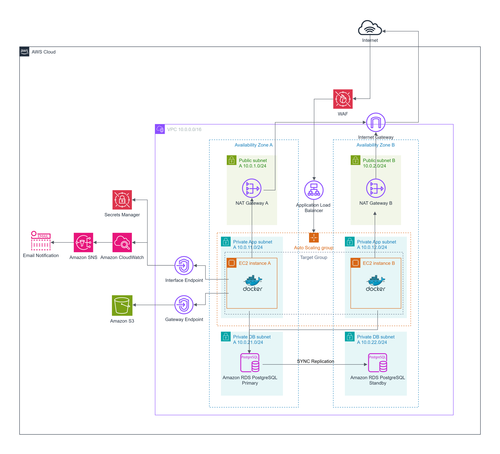

# Architecture

## Overview

The **Production-Inspired Highly Available Cloud Platform on AWS** is a cloud-native web application platform designed following AWS Well-Architected Framework principles. The solution demonstrates how to deploy a secure, scalable, and highly available containerized application using Infrastructure as Code (IaC), modern networking practices, and AWS managed services.

The entire infrastructure is provisioned using **Terraform**, while the application is packaged as a **Docker** container and deployed on **Amazon EC2 Auto Scaling** instances behind an **Application Load Balancer**.

The architecture emphasizes:

- High Availability
- Scalability
- Security
- Automation
- Reliability
- Operational Excellence

---

# Architecture Diagram

    

The architecture distributes resources across two Availability Zones to provide fault tolerance while maintaining private connectivity between application components.

---

# Architecture Goals

The primary design goals are:

- Provide High Availability across multiple Availability Zones.
- Eliminate single points of failure.
- Automatically scale compute resources.
- Protect infrastructure using multiple security layers.
- Keep sensitive resources isolated inside private subnets.
- Automate infrastructure provisioning with Terraform.
- Simplify operational management through managed AWS services.
- Follow AWS Well-Architected Framework best practices.

---

# Request Flow

The following sequence describes how client requests are processed.

1. A client sends an HTTPS request.
2. AWS WAF inspects incoming traffic.
3. The request reaches the Application Load Balancer.
4. The ALB forwards traffic to healthy EC2 instances.
5. The Flask application processes the request.
6. Application data is stored or retrieved from Amazon RDS.
7. User-uploaded files are stored in Amazon S3.
8. Application metrics and logs are collected by Amazon CloudWatch.
9. CloudWatch Alarms notify administrators through Amazon SNS when necessary.

---

# Architecture Components

## Networking

The networking layer provides secure communication between all resources.

Components include:

- Amazon VPC
- Public Subnets
- Private Application Subnets
- Private Database Subnets
- Internet Gateway
- NAT Gateway
- Route Tables
- Security Groups
- VPC Interface Endpoints
- Gateway Endpoint for Amazon S3

A dedicated networking document is available in:

- [Networking Documentation](networking.md)

---

## Compute Layer

Application containers run on Amazon EC2 instances managed by an Auto Scaling Group.

The compute layer provides:

- Automatic instance replacement
- Horizontal scaling
- High availability
- Self-healing infrastructure

Each EC2 instance:

- Runs Docker
- Pulls application images from Amazon ECR
- Retrieves secrets from AWS Secrets Manager
- Uses IAM Roles instead of static credentials
- Is managed securely through AWS Systems Manager Session Manager

---

## Load Balancing

An Application Load Balancer distributes incoming requests across healthy EC2 instances.

Benefits include:

- Traffic distribution
- Health checks
- High availability
- Fault tolerance

The ALB routes traffic only to healthy instances, improving application reliability.

---

## Database Layer

Amazon RDS PostgreSQL provides managed relational database services.

Features include:

- Multi-AZ deployment
- Automated backups
- High availability
- Managed maintenance
- Automatic failover

The database resides inside dedicated private database subnets and is inaccessible from the public internet.

---

## Object Storage

Amazon S3 stores application files uploaded by users.

Benefits include:

- Highly durable storage
- Virtually unlimited scalability
- Integration with private VPC Gateway Endpoints

Traffic between EC2 instances and Amazon S3 remains within the AWS network.

---

## Container Platform

The Flask application is packaged as a Docker container.

Containerization provides:

- Consistent runtime environments
- Simplified deployments
- Easy application updates
- Improved portability

Container images are stored in Amazon Elastic Container Registry (ECR).

---

## Infrastructure as Code

The entire AWS infrastructure is provisioned using Terraform.

Infrastructure as Code enables:

- Version-controlled infrastructure
- Repeatable deployments
- Consistent environments
- Reduced manual configuration

Terraform manages all AWS resources used by the project.

---

# Security Layer

Security follows a defense-in-depth approach.

Implemented security controls include:

- AWS WAF
- IAM Roles
- Security Groups
- Private Subnets
- AWS Secrets Manager
- AWS Systems Manager Session Manager
- VPC Interface Endpoints
- Amazon S3 Gateway Endpoint

Sensitive resources are never directly exposed to the public internet.

Additional security details are available in:

- [Security Documentation](security.md)

---

# Monitoring & Observability

Operational visibility is provided through Amazon CloudWatch and Amazon SNS.

Monitoring capabilities include:

- Infrastructure Metrics
- Application Logs
- CloudWatch Alarms
- Email Notifications
- Health Monitoring

CloudWatch continuously monitors the platform and provides alerts whenever operational thresholds are exceeded.

---

# High Availability

The platform is designed to remain operational even during infrastructure failures.

High Availability is achieved through:

- Multiple Availability Zones
- Application Load Balancer
- Auto Scaling Group
- Amazon RDS Multi-AZ
- Automatic Health Checks
- Automatic Instance Replacement

These mechanisms eliminate single points of failure and improve system resilience.

---

# Scalability

The architecture supports horizontal scaling.

Scaling capabilities include:

- EC2 Auto Scaling
- Elastic Load Balancing
- Amazon S3
- Amazon RDS
- Containerized Workloads

Additional compute capacity can be added automatically as demand increases.

---

# Reliability

Reliability is improved through:

- Managed AWS Services
- Health Checks
- Auto Scaling
- Multi-AZ Database
- Private Networking
- Infrastructure as Code

These components reduce operational risk and improve service availability.

---

# Operational Excellence

Operational Excellence is achieved through:

- Infrastructure as Code
- Git Version Control
- GitHub Actions
- Docker
- CloudWatch Monitoring
- Session Manager
- Automated Deployments

The platform minimizes manual operational tasks while improving deployment consistency.

---

# Architecture Design Decisions

Several design decisions were made to improve security, scalability, and maintainability.

| Decision | Reason |
|----------|--------|
| Terraform | Infrastructure as Code and repeatable deployments |
| Docker | Consistent application runtime |
| Auto Scaling | Automatic scaling and self-healing |
| Application Load Balancer | Traffic distribution and health checks |
| RDS Multi-AZ | High Availability |
| Private Subnets | Protect internal resources |
| VPC Endpoints | Private AWS service connectivity |
| IAM Roles | Eliminate static credentials |
| Secrets Manager | Secure secret storage |
| Session Manager | Secure administrative access |
| AWS WAF | Layer 7 application protection |
| CloudWatch | Centralized monitoring |
| SNS | Automated notifications |

---

# AWS Well-Architected Framework

This project aligns with the six pillars of the AWS Well-Architected Framework.

| Pillar | Implementation |
|---------|----------------|
| Operational Excellence | Terraform, GitHub Actions, CloudWatch |
| Security | IAM, WAF, Secrets Manager, Session Manager |
| Reliability | Multi-AZ, Auto Scaling, Health Checks |
| Performance Efficiency | Auto Scaling, ALB, Docker |
| Cost Optimization | Managed Services, Auto Scaling, S3 |
| Sustainability | Elastic resource allocation and managed AWS services |

---

# Future Enhancements

Potential future improvements include:

- Amazon ECS
- Amazon EKS
- CloudFront
- Route 53
- AWS Certificate Manager (ACM)
- HTTPS End-to-End
- AWS Backup
- AWS X-Ray
- Amazon Managed Grafana
- Terraform Remote Backend
- Blue/Green Deployments
- Multi-Environment Infrastructure

---

# Related Documentation

Additional technical documentation is available in the following files:

- [Networking](networking.md)
- [Security](security.md)
- [Troubleshooting](troubleshooting.md)