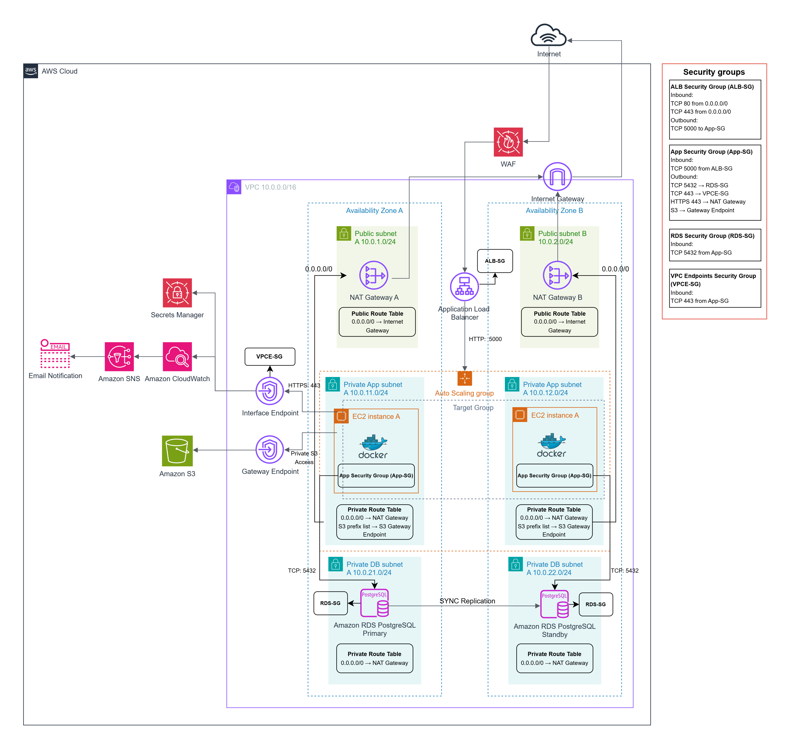

# Networking

## Overview

The networking architecture provides secure, highly available, and scalable communication between all infrastructure components.

The platform is deployed inside a dedicated Amazon Virtual Private Cloud (VPC) and follows a layered network design that separates internet-facing resources from internal application and database services.

The network is designed according to AWS networking best practices, emphasizing isolation, private connectivity, fault tolerance, and least-privilege access.

---

# Network Diagram

    

The network spans two Availability Zones to provide redundancy and eliminate single points of failure.

---

# Network Design Goals

The networking architecture was designed with the following objectives:

- Isolate public and private resources.
- Eliminate direct internet access to sensitive workloads.
- Support High Availability across multiple Availability Zones.
- Enable secure communication between AWS services.
- Reduce the attack surface.
- Support automatic scaling.
- Follow AWS networking best practices.

---

# Virtual Private Cloud (VPC)

All resources are deployed inside a dedicated Amazon VPC.

The VPC provides:

- Logical network isolation.
- Private IP address management.
- Controlled routing.
- Secure communication between AWS resources.

The VPC acts as the foundation of the entire cloud infrastructure.

---

# Availability Zones

Resources are distributed across two independent Availability Zones.

Benefits include:

- Fault tolerance.
- High Availability.
- Improved reliability.
- Automatic failover support.

If one Availability Zone becomes unavailable, the application continues operating from the remaining zone.

---

# Subnet Architecture

The VPC is divided into six subnets.

| Subnet Type | Quantity | Purpose |
|--------------|---------:|---------|
| Public Subnets | 2 | Internet-facing resources |
| Private Application Subnets | 2 | EC2 application servers |
| Private Database Subnets | 2 | Amazon RDS |

This separation limits network exposure and improves security.

---

# Public Subnets

Public subnets contain resources that must be reachable from the internet.

Resources include:

- Application Load Balancer
- NAT Gateway

Public subnets have a route to the Internet Gateway.

---

# Private Application Subnets

The application layer is deployed inside private subnets.

Resources include:

- EC2 Instances
- Docker Containers

Application servers:

- Do not have public IP addresses.
- Receive traffic only from the Application Load Balancer.
- Access AWS services through VPC Endpoints.
- Access the internet only through the NAT Gateway when required.

---

# Private Database Subnets

Amazon RDS is deployed inside dedicated private database subnets.

The database:

- Has no public endpoint.
- Accepts connections only from the application layer.
- Is isolated from direct internet access.
- Supports Multi-AZ deployment.

This design significantly reduces database exposure.

---

# Internet Gateway

The Internet Gateway enables communication between public resources and the internet.

Used by:

- Application Load Balancer
- NAT Gateway

Private resources never communicate directly with the Internet Gateway.

---

# NAT Gateway

The NAT Gateway provides outbound internet access for private resources.

Typical use cases include:

- Pulling Docker images.
- Installing operating system updates.
- Downloading software packages.

Inbound internet connections to private instances are never allowed.

---

# Route Tables

The architecture uses separate route tables for public and private resources.

## Public Route Table

Routes include:

- Local VPC traffic.
- Internet traffic through the Internet Gateway.

Associated with:

- Public Subnets

---

## Private Route Table

Routes include:

- Local VPC traffic.
- Internet access through the NAT Gateway.
- Private AWS service connectivity using VPC Endpoints.

Associated with:

- Private Application Subnets
- Private Database Subnets

---

# Security Groups

Security Groups provide stateful network-level firewall protection.

The project uses dedicated Security Groups for each layer.

| Security Group | Purpose |
|----------------|---------|
| ALB Security Group | Internet-facing traffic |
| Application Security Group | Application servers |
| Database Security Group | Amazon RDS |
| VPC Endpoint Security Group | Interface Endpoints |

Traffic is allowed only when explicitly required.

Detailed Security Group rules are documented in the Security Guide.

---

# VPC Interface Endpoints

Interface Endpoints provide private connectivity to AWS services without traversing the public internet.

Configured Interface Endpoints include:

- Amazon ECR API
- Amazon ECR Docker Registry
- AWS Secrets Manager
- Amazon CloudWatch Logs

Benefits include:

- Improved security.
- Reduced exposure to the internet.
- Lower latency.
- Private AWS networking.

---

# Amazon S3 Gateway Endpoint

Amazon S3 uses a Gateway Endpoint.

Benefits include:

- Private S3 connectivity.
- No internet traversal.
- Reduced NAT Gateway usage.
- Improved security.

Traffic between EC2 instances and Amazon S3 remains inside the AWS network.

---

# Network Traffic Flow

The typical request flow is:

Internet

↓

AWS WAF

↓

Application Load Balancer

↓

EC2 Auto Scaling Group

↓

Amazon RDS

↓

Amazon S3 (Gateway Endpoint)

↓

CloudWatch / Secrets Manager (Interface Endpoints)

This design ensures that sensitive resources remain inaccessible from the public internet.

---

# Network Isolation Strategy

The network follows a layered isolation model.

### Internet Layer

- Application Load Balancer
- NAT Gateway

### Application Layer

- EC2 Instances
- Docker Containers

### Data Layer

- Amazon RDS

Each layer communicates only with the layer immediately above or below it.

This minimizes lateral movement in the event of a security incident.

---

# Private AWS Service Connectivity

Application servers access AWS managed services privately using VPC Endpoints.

Private connectivity is configured for:

- Amazon ECR
- Amazon S3
- AWS Secrets Manager
- Amazon CloudWatch Logs

This reduces internet dependency while improving security.

---

# High Availability Networking

The network is designed to tolerate Availability Zone failures.

High Availability is achieved through:

- Two Availability Zones
- Multiple Public Subnets
- Multiple Private Application Subnets
- Multiple Private Database Subnets
- Application Load Balancer
- Auto Scaling Group
- Amazon RDS Multi-AZ

The failure of a single Availability Zone does not interrupt application availability.

---

# Networking Best Practices

The networking architecture follows several AWS best practices.

Implemented practices include:

- Public and private subnet separation.
- Least-privilege network access.
- Security Group isolation.
- Multi-AZ deployment.
- Private AWS service connectivity using VPC Endpoints.
- Private database deployment.
- No public IP addresses for EC2 instances.
- Infrastructure as Code using Terraform.

These practices improve security, resilience, and maintainability.

---

# Future Enhancements

Potential networking improvements include:

- IPv6 Support
- AWS Network Firewall
- Transit Gateway
- AWS Cloud WAN
- Multi-Region Architecture
- AWS Global Accelerator
- VPC Flow Logs
- PrivateLink for additional AWS services

---

# Related Documentation

Additional documentation is available in:

- [Architecture](architecture.md)
- [Security](security.md)
- [Troubleshooting](troubleshooting.md)